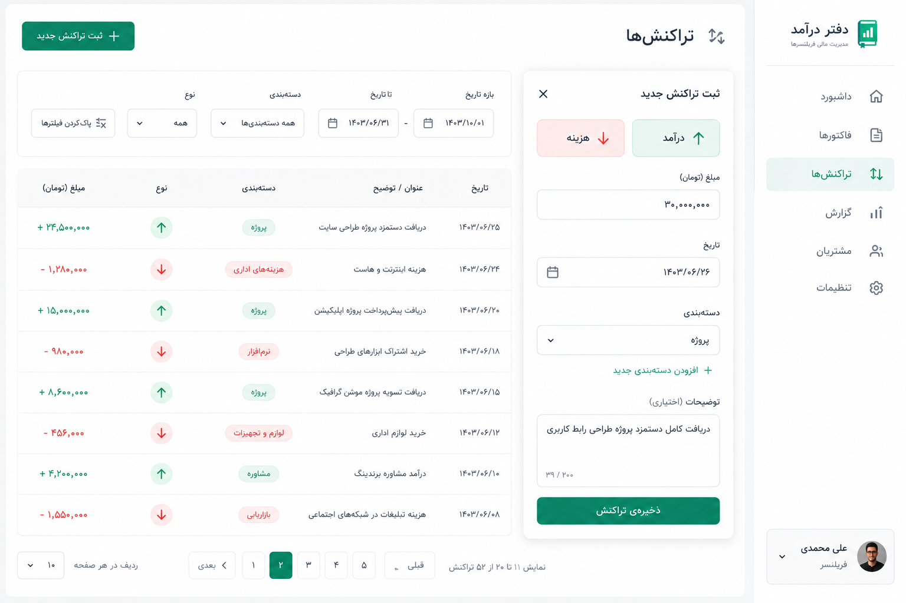
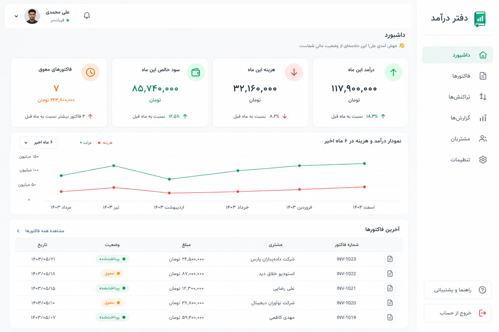
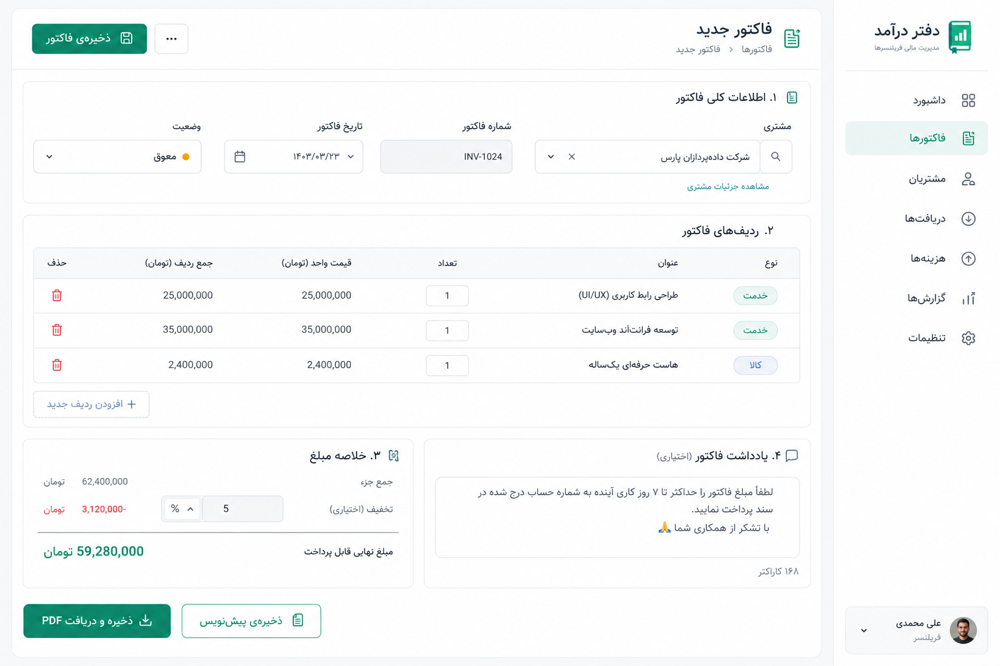
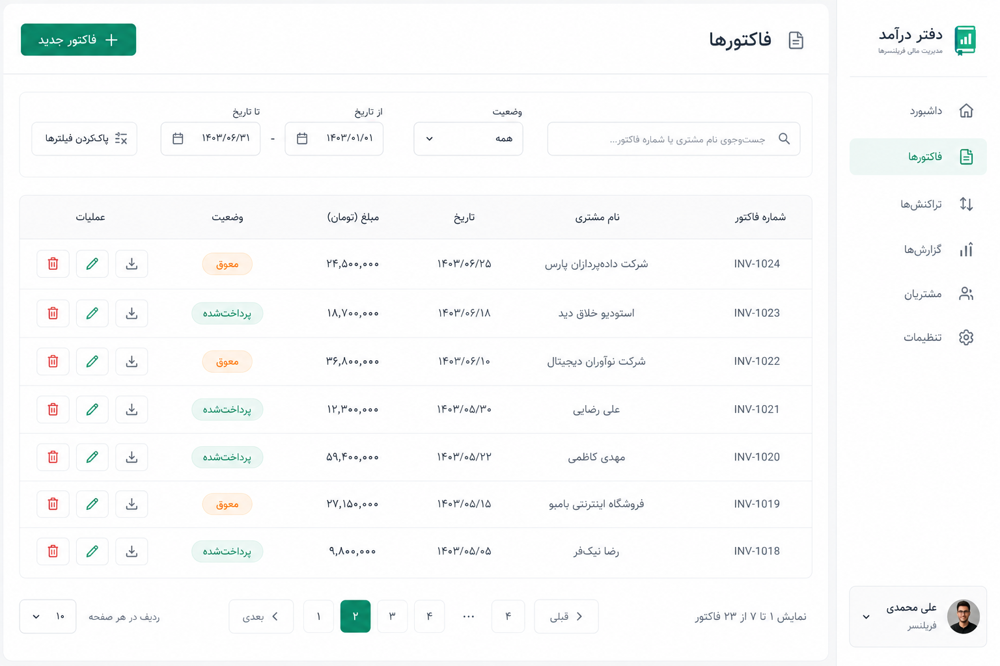

<div align="center">

# 📒 دفتر درآمد

**ابزار متن‌باز و رایگان مدیریت درآمد، هزینه و فاکتور برای فریلنسرها و کسب‌وکارهای کوچک**


</div>

---

## 📌 مشکل چیه؟

حجم بالای فریلنسرها و کسبه‌های ایرانی به‌خاطر تعداد زیاد تراکنش‌های ثبت‌شده در اپ‌های بانکی، توانایی محاسبه‌ی دقیق سود، زیان و وضعیت مالی کسب‌وکار خودشون رو ندارن یا با درصد خطای بالا این کار رو انجام می‌دن. استفاده از نرم‌افزارهای حسابداری پیچیده یا استخدام حسابدار هم برای خیلی‌ها به‌صرفه نیست.

**دفتر درآمد** یه سیستم حسابداری پایه و ساده‌ست که این مشکل رو حل می‌کنه: مقادیر و درصدهای مالی مورد نیازتون رو در قالب نمودار، کارت‌های خلاصه و گزارش قابل چاپ (PDF) در اختیارتون می‌ذاره — کاملاً رایگان و متن‌باز.

---

## 🖼 پیش‌نمایش

<!--
عکس‌های محیط برنامه رو اینجا با مسیر واقعی فایل‌هاشون جایگزین کن، مثلاً:



پیشنهاد: قبل از جایگزینی، اسم فایل‌ها رو از هش تصادفی به اسم معنادار تغییر بده
(مثلاً dashboard.png, invoice-form.png) تا هم اینجا تمیزتر باشه هم تو ریپو قابل‌فهم‌تر.
-->

| داشبورد | فرم فاکتور |
|---|---|
|  |  |

| لیست فاکتورها | گزارش مالی |
|---|---|
|  |  |

---

## ✨ امکانات

| ویژگی | توضیح |
|---|---|
| 👤 مدیریت مشتری | ثبت نام، مشخصات و توضیحات هر مشتری برای دسترسی سریع به سوابق خرید |
| 🧾 صدور فاکتور | ساخت فاکتور با چند ردیف کالا/خدمت و خروجی PDF قابل چاپ و سفارشی‌سازی |
| 💰 درآمد و هزینه | ثبت دستی تراکنش‌ها و محاسبه‌ی خودکار سود و زیان با دسته‌بندی دلخواه |
| 📊 گزارش و نمودار | نمایش وضعیت مالی در قالب نمودار خطی، ستونی و دایره‌ای |
| 🗂 آرشیو | نگهداری و دسترسی به سوابق مالی قدیمی‌تر |

---

## 🛠 تکنولوژی

- **Frontend:** React (Vite), React Router, Recharts
- **Backend:** Django, Django REST Framework, Simple JWT
- **PDF:** WeasyPrint (با فونت فارسی Vazirmatn)

---

## 🚀 نصب و راه‌اندازی

### پیش‌نیازها
- Python 3.11+
- Node.js 18+

### بک‌اند (Django)

```bash
cd daftar
python -m venv venv
venv\Scripts\activate        # ویندوز
# source venv/bin/activate   # مک/لینوکس

pip install -r requirements.txt
```

یه فایل `.env` بساز (از روی `.env.example` کپی کن) و مقادیر لازم رو پر کن:

```
SECRET_KEY=یک-کلید-تصادفی-امن-بساز
DEBUG=True
ALLOWED_HOSTS=127.0.0.1,localhost
CORS_ALLOWED_ORIGINS=http://localhost:5173,http://127.0.0.1:5173
```

بعد:

```bash
python manage.py migrate
python manage.py createsuperuser
python manage.py runserver
```

### فرانت‌اند (React)

```bash
cd frontend
npm install
npm run dev
```

پیش‌فرض روی `http://localhost:5173` بالا میاد و به بک‌اند روی `http://127.0.0.1:8000` وصل می‌شه.

---

## 🗺 نقشه‌ی راه (Roadmap)

### نسخه‌ی اول (MVP) — تکمیل‌شده ✅
- [x] مدیریت مشتری (افزودن/ویرایش/حذف)
- [x] ساخت و مدیریت فاکتور (ردیف‌های دینامیک، محاسبه‌ی خودکار)
- [x] خروجی PDF فاکتور
- [x] ثبت دستی درآمد و هزینه با دسته‌بندی دلخواه
- [x] داشبورد و گزارش خلاصه
- [x] نمودار روند درآمد و هزینه
- [x] ثبت‌نام و ورود کاربر (JWT)
- [ ] دیپلوی نسخه‌ی آنلاین (دمو)

### بعد از نسخه‌ی اول (نیازمند بررسی یا حمایت مالی 💛)
- [ ] محاسبه‌ی مالیات
- [ ] اتصال به درگاه پرداخت
- [ ] ارسال خودکار فاکتور (ایمیل/پیامک)
- [ ] پشتیبانی چندکاربره/تیمی
- [ ] تقویم شمسی کامل در بک‌اند (فعلاً تاریخ‌ها میلادی ذخیره می‌شن)

---

## 📝 آخرین تغییرات

| تاریخ | تغییر |
|---|---|
| — | نسخه‌ی اول تکمیل شد؛ در انتظار دیپلوی |

---

## 💛 حمایت از پروژه

این پروژه کاملاً رایگان و متن‌باز عرضه می‌شه. اگه ازش استفاده کردید و راضی بودید، حمایت مالی شما کمک می‌کنه فیچرهایی که هزینه‌ی نگهداری ماهانه دارن (مثل هاست نسخه‌ی آنلاین) پابرجا بمونن. لینک حمایت به‌زودی اینجا قرار می‌گیره.

## 🤝 مشارکت

چون این پروژه متن‌بازه، هرگونه گزارش باگ، پیشنهاد یا Pull Request خوش‌آمده. اگه باگی دیدید، از طریق بخش Issues گیت‌هاب مطلع‌مون کنید تا برای همه رفع بشه.

## 📄 لایسنس

این پروژه تحت لایسنس MIT منتشر می‌شه.
