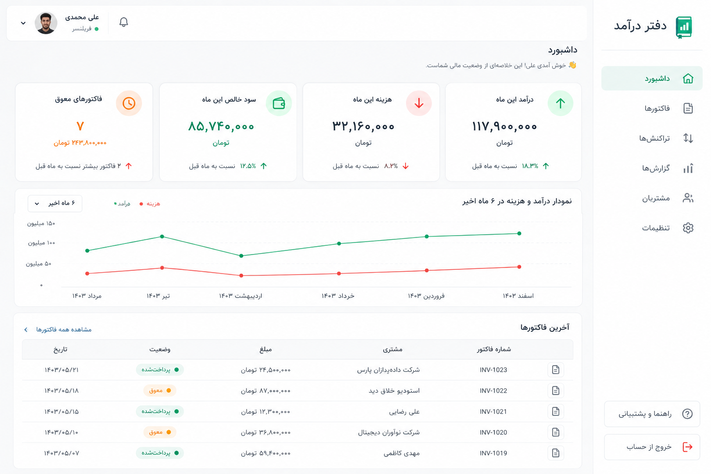
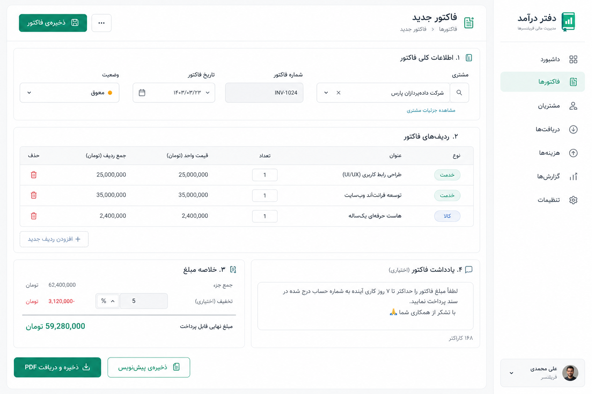
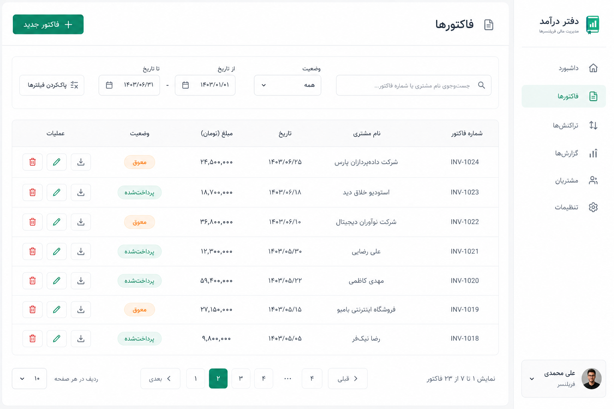
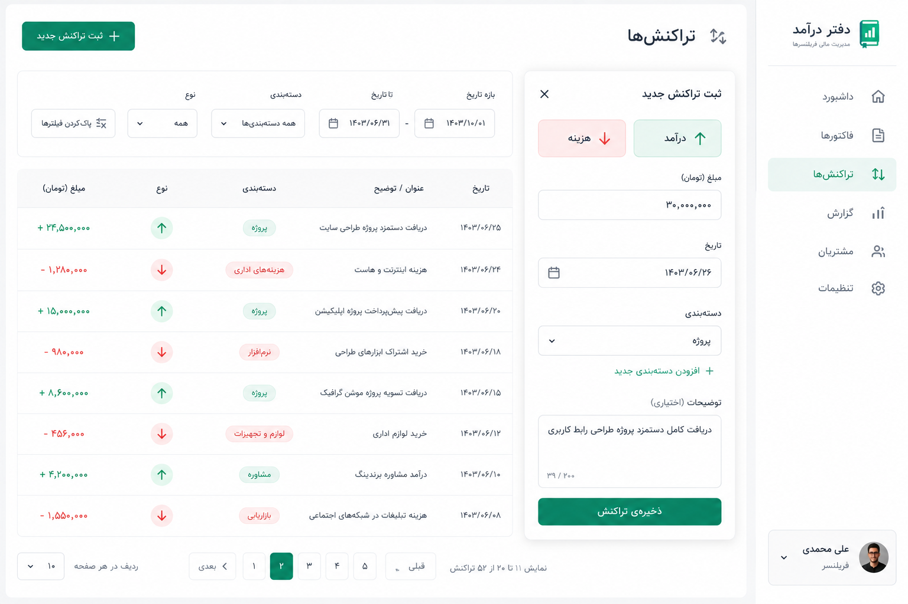

<div align="center" dir="rtl">

<br>


# دفتر درآمد

### `DAFTAR`

**یک دفتر مالی دیجیتال، ساده برای استفاده و جدی برای ساختن.**

مدیریت مشتری، فاکتور، درآمد، هزینه و گزارش‌های مالی  
در یک محیط فارسی، مینیمال و متن‌باز.

<br>

[](#)
[](./LICENSE)
[](#)
[](#)

<br>

`مدیریت مالی` · `فاکتور` · `مشتری` · `گزارش`

<br><br>

</div>

---

<div dir="rtl">

## `01` · ایده

### وقتی عددها زیاد می‌شوند، تصویر کلی نباید گم شود.

فریلنسرها و کسب‌وکارهای کوچک معمولاً اطلاعات مالی خود را در چند جای مختلف نگهداری می‌کنند؛
فاکتورها یک‌جا، هزینه‌ها جای دیگر و اطلاعات مشتریان در فایل‌ها و یادداشت‌های مختلف.

**دفتر درآمد** برای جمع کردن همین قطعات ساخته شده است.

یک محیط ساده برای اینکه بتوانید:

```text
مشتری
   ↓
فاکتور
   ↓
درآمد / هزینه
   ↓
گزارش
   ↓
تصویر واضح‌تر از وضعیت مالی
```

بدون اینکه برای ثبت یک هزینه ساده مجبور شوید با یک نرم‌افزار حسابداری سنگین دست‌وپنجه نرم کنید.

---

# `02` · DAFTAR EXPERIENCE

<div align="center">

### یک رابط کاربری فارسی، نه ترجمه‌شده

</div>

دفتر درآمد از ابتدا با تمرکز روی استفاده فارسی طراحی شده است.

- راست‌چین بودن رابط کاربری
- استفاده از فونت **Vazirmatn**
- نمایش خوانای مبالغ
- طراحی واکنش‌گرا
- کارت‌ها و نمودارهای مینیمال
- تمرکز روی اطلاعات مهم به جای شلوغ کردن صفحه

<br>

<div align="center">

> **Less clutter. More clarity.**

</div>

---

# `03` · امکانات

<table>
<tr>

<td width="50%" valign="top">

### 👤 مشتریان

مدیریت اطلاعات مشتریان و دسترسی سریع به سوابق آن‌ها.

**شامل:**

- ایجاد مشتری
- ویرایش مشتری
- حذف مشتری
- شماره تماس
- یادداشت
- استفاده مستقیم هنگام ایجاد فاکتور
- مشاهده سوابق مرتبط

</td>

<td width="50%" valign="top">

### 🧾 فاکتورها

ایجاد و مدیریت فاکتورهای کالا و خدمات.

**شامل:**

- چند قلم در هر فاکتور
- کالا یا خدمت
- تعداد
- قیمت واحد
- تخفیف
- وضعیت پرداخت
- شماره فاکتور
- توضیحات
- چاپ
- خروجی PDF

</td>

</tr>

<tr>

<td width="50%" valign="top">

### 💰 درآمد و هزینه

ثبت جریان‌های مالی روزمره بدون پیچیدگی اضافه.

**شامل:**

- درآمد
- هزینه
- دسته‌بندی
- مبلغ
- تاریخ
- توضیحات
- سوابق تراکنش‌ها

</td>

<td width="50%" valign="top">

### 📊 گزارش و داشبورد

اطلاعات خام را به تصویری قابل فهم تبدیل می‌کند.

**شامل:**

- خلاصه مالی
- روند درآمد
- روند هزینه
- نمودار خطی
- نمودار ستونی
- نمودار دایره‌ای
- تحلیل دسته‌بندی هزینه‌ها

</td>

</tr>

<tr>

<td width="50%" valign="top">

### 📥 Excel Import

برای زمانی که اطلاعات از قبل وجود دارد.

- ورود اطلاعات از Excel
- کاهش ورود دستی
- اعتبارسنجی داده‌ها
- نمایش خطاهای قابل فهم
- پشتیبانی از بخش‌های مختلف داده

</td>

<td width="50%" valign="top">

### ⚙️ تنظیمات

کنترل جزئیات کسب‌وکار از یک نقطه.

- نام کسب‌وکار
- پیشوند فاکتور
- متن پیش‌فرض فاکتور
- تنظیمات اطلاع‌رسانی

</td>

</tr>
</table>

---

# `04` · داخل برنامه

<div align="center">

### Dashboard



<br><br>

### Invoice



<br><br>

<table>
<tr>
<td width="50%">

### Invoices



</td>

<td width="50%">

### Reports



</td>
</tr>
</table>

</div>

---

# `05` · معماری

دفتر درآمد از دو بخش اصلی تشکیل شده است:

```text
                         DAFTAR
                           │
             ┌─────────────┴─────────────┐
             │                           │
         FRONTEND                    BACKEND
             │                           │
          React                       Django
             │                           │
       React Router                Django REST API
             │                           │
         Axios                      Simple JWT
             │                           │
             └─────────────┬─────────────┘
                           │
                       DATABASE
                           │
                  ┌────────┴────────┐
                  │                 │
                SQLite          PostgreSQL
```

### Frontend

رابط کاربری با React ساخته شده و مسئول نمایش اطلاعات، تعامل کاربر و ارتباط با API است.

### Backend

Django و Django REST Framework منطق سمت سرور، احراز هویت و دسترسی به داده‌ها را مدیریت می‌کنند.

### Database

برای اجرای محلی SQLite و برای محیط‌های سروری PostgreSQL در نظر گرفته شده است.

---

# `06` · Stack

<div align="center">

| Layer | Technology |
|:---:|:---:|
| UI | React |
| Build | Vite |
| Routing | React Router |
| HTTP | Axios |
| Charts | Recharts |
| Backend | Django |
| API | Django REST Framework |
| Authentication | Simple JWT |
| Local Database | SQLite |
| Server Database | PostgreSQL |
| PDF | WeasyPrint |
| Typography | Vazirmatn |

</div>

---

# `07` · ساختار پروژه

```text
Daftar/
│
├── frontend/
│   ├── public/
│   ├── src/
│   │   ├── components/
│   │   ├── pages/
│   │   ├── contexts/
│   │   └── ...
│   │
│   ├── package.json
│   └── ...
│
├── manage.py
├── requirements.txt
├── .env.example
├── LICENSE
└── README.md
```

ساختار واقعی پروژه ممکن است با توسعه قابلیت‌های جدید تغییر کند.

---

# `08` · راه‌اندازی

## Requirements

قبل از شروع، موارد زیر را داشته باشید:

```text
Python 3.11+
Node.js 18+
npm
Git
```

---

## Backend

ساخت محیط مجازی:

```bash
python -m venv venv
```

### Windows

```powershell
.\venv\Scripts\Activate.ps1
```

یا:

```bat
venv\Scripts\activate
```

### Linux / macOS

```bash
source venv/bin/activate
```

نصب وابستگی‌ها:

```bash
pip install -r requirements.txt
```

---

## Environment

یک فایل `.env` بر اساس `.env.example` بسازید:

```env
SECRET_KEY=replace-with-a-random-secret-key
DEBUG=True
ALLOWED_HOSTS=127.0.0.1,localhost
CORS_ALLOWED_ORIGINS=http://localhost:5173,http://127.0.0.1:5173
```

> فایل `.env` نباید در مخزن عمومی قرار بگیرد.

---

## Database

```bash
python manage.py migrate
```

ساخت حساب مدیریتی:

```bash
python manage.py createsuperuser
```

---

## Run Backend

```bash
python manage.py runserver
```

Backend:

```text
http://127.0.0.1:8000
```

---

## Run Frontend

در ترمینال جداگانه:

```bash
cd frontend
npm install
npm run dev
```

Frontend:

```text
http://localhost:5173
```

> `runserver` و `npm run dev` برای توسعه هستند و برای استقرار عمومی توصیه نمی‌شوند.

---

# `09` · وضعیت توسعه

<div align="center">

### 🟢 ACTIVE DEVELOPMENT

دفتر درآمد هنوز یک پروژه در حال توسعه است.

</div>

### تکمیل‌شده

```text
✓ Authentication
✓ Customer Management
✓ Invoice Management
✓ Invoice PDF
✓ Income & Expense
✓ Categories
✓ Dashboard
✓ Financial Reports
✓ Charts
✓ Business Settings
✓ Excel Import
✓ Responsive UI
✓ Persian RTL Interface
```

### در حال بهبود

```text
→ UX
→ Excel Import
→ Data Validation
→ Reports
→ Performance
→ Local Installation
→ Backup & Recovery
```

---

# `10` · Roadmap

Roadmap دفتر درآمد قرار نیست یک لیست بی‌پایان از قابلیت‌ها باشد.

تمرکز اصلی روی **ساده‌تر، سریع‌تر و قابل‌اعتمادتر کردن کارهای روزمره** است.

```text
NOW
 │
 ├── UX Improvements
 ├── Better Import
 ├── Data Validation
 └── Performance
       │
       ▼
NEXT
 │
 ├── Advanced Reports
 ├── Persian Calendar
 ├── Backup / Restore
 └── Local Installer
       │
       ▼
LATER
 │
 ├── Tax Features
 ├── Email / SMS
 ├── Payment Gateway
 └── Team Accounts
```

---

# `11` · طراحی برای چه کسانی است؟

دفتر درآمد برای کسانی ساخته شده که:

```text
                ┌──────────────────────┐
                │       DAFTAR         │
                └──────────┬───────────┘
                           │
          ┌────────────────┼────────────────┐
          │                │                │
          ▼                ▼                ▼
      Freelancer       Small Business    Solo Business
          │                │                │
          └────────────────┼────────────────┘
                           │
                           ▼
                  Simple Financial
                     Management
```

تمرکز پروژه روی کسب‌وکارهایی است که مدیریت مالی روزمره می‌خواهند، اما لزوماً به یک سیستم حسابداری پیچیده نیاز ندارند.

---

# `12` · فلسفه پروژه

<div align="center">

### دفتر درآمد قرار نیست همه‌چیز باشد.

### قرار است چیزهای مهم را ساده کند.

<br>

`ثبت کن.`  
`ببین.`  
`گزارش بگیر.`  
`تصمیم بگیر.`

</div>

---

# `13` · مشارکت

دفتر درآمد یک پروژه متن‌باز است و مشارکت در آن آزاد است.

راه‌های مشارکت:

```text
🐛 Bug Report
     │
     ▼
💡 Feature Request
     │
     ▼
🔧 Pull Request
     │
     ▼
🧪 Testing
     │
     ▼
📚 Documentation
```

### روند پیشنهادی

1. Repository را Fork کنید.
2. یک Branch جدید بسازید.
3. تغییرات را اعمال کنید.
4. تست کنید.
5. Pull Request ارسال کنید.

برای تغییرات بزرگ، ابتدا یک Issue ایجاد کنید تا درباره محدوده تغییر صحبت شود.

---

# `14` · حمایت

اگر دفتر درآمد برای شما مفید است، می‌توانید با یکی از این کارها از پروژه حمایت کنید:

- ⭐ Star کردن Repository
- 🐛 گزارش باگ
- 💡 پیشنهاد قابلیت
- 🔧 ارسال Pull Request
- 📖 بهبود مستندات
- 📣 معرفی پروژه

---

# `15` · License

دفتر درآمد تحت **MIT License** منتشر شده است.

```text
MIT License
```

برای جزئیات کامل، فایل [`LICENSE`](./LICENSE) را مشاهده کنید.

---

<div align="center" dir="rtl">

<br>


# دفتر درآمد

### `DAFTAR`

**یک دفتر ساده برای یک تصویر واضح‌تر.**

<br>

`React` · `Django` · `Open Source` · `MIT`

<br>

---

ساخته‌شده برای فریلنسرها و کسب‌وکارهای کوچک.

⭐ اگر پروژه برایت مفید بود، یک Star خوشحال‌مان می‌کند.

<br>

</div>